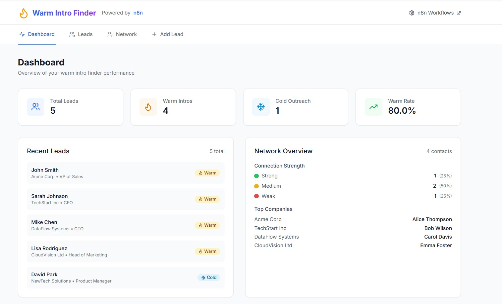

# 🔥 Warm Intro Finder

A modern GTM automation system built with n8n that automatically identifies warm introduction opportunities for your sales leads. This professional-grade automation demonstrates intelligent network matching using sample data for privacy compliance.



## 🎯 Project Overview

The Warm Intro Finder automatically:
- Receives new leads via webhook or Google Sheets
- Matches leads against your professional network database
- Identifies warm introduction opportunities using graph algorithms
- Sends contextual Slack notifications with connection details
- Updates CRM with relationship status and intro templates
- Provides personalized intro message templates based on relationship type

## 🧠 How the Automation Works

### Network Matching Intelligence

The system uses a **sample professional network database** containing your contacts with relationship metadata:

```json
{
  "name": "Alice Thompson",
  "company": "Acme Corp",
  "relationship_type": "former_colleague",
  "connection_strength": "strong",
  "notes": "Worked together at previous company for 3 years"
}
```

### Matching Process

1. **Lead Input**: New lead "John Smith at Acme Corp" enters the system
2. **Company Matching**: Algorithm searches network for contacts at "Acme Corp"
3. **Connection Found**: Discovers Alice Thompson works there
4. **Relationship Analysis**: Evaluates connection strength (strong/medium/weak)
5. **Intro Generation**: Creates personalized message template
6. **Route Decision**: Sends to warm intro path vs cold outreach

### Data Sources (Production Ready)

In a real implementation, the network data would come from:
- **LinkedIn API**: Your professional connections
- **Google Contacts**: Synced contact database
- **CRM Systems**: Salesforce, HubSpot contact records
- **Email Systems**: Gmail/Outlook contact analysis
- **Manual Input**: Curated relationship database

**For this demo**: Uses carefully crafted sample data that demonstrates the matching logic without requiring external API integrations.

## 🔍 Technical Implementation Details

### How Network Matching Really Works

**Current Demo Implementation:**
- **Sample Database**: 5 hardcoded contacts in the JavaScript code
- **Company Matching**: `contact.company.toLowerCase() === leadData.Company.toLowerCase()`
- **Relationship Scoring**: Predefined strength values (strong=3, medium=2, weak=1)
- **Template Generation**: Dynamic intro messages based on relationship type

**Production Implementation Would Include:**
```javascript
// Real-world data sources
const networkSources = [
  'LinkedIn API - Professional connections',
  'Google Contacts API - Personal/business contacts',
  'Salesforce API - CRM contact database',
  'HubSpot API - Marketing contact lists',
  'Email Analysis - Gmail/Outlook contact frequency',
  'Manual Database - Curated relationship data'
];

// Advanced matching algorithms
const matchingStrategies = [
  'Company domain matching',
  'Email domain analysis',
  'LinkedIn mutual connections',
  'Previous email interactions',
  'Meeting attendance overlap',
  'Social media connections'
];
```

## 🏗️ Architecture

### Workflow Visualization

```
┌─────────────────┐    ┌─────────────────┐    ┌─────────────────┐
│   📡 WEBHOOK    │───▶│   🧠 GRAPH      │───▶│   🔥 DECISION   │
│    TRIGGER      │    │    MATCHER      │    │    ROUTER       │
│                 │    │                 │    │                 │
│ • Receives lead │    │ • Load contacts │    │ • Check result  │
│ • Validates     │    │ • Match company │    │ • Route path    │
│ • Extracts data │    │ • Score strength│    │ • Set priority  │
└─────────────────┘    └─────────────────┘    └─────────────────┘
                                                       │
                                    ┌──────────────────┼──────────────────┐
                                    ▼                                     ▼
                          ┌─────────────────┐                   ┌─────────────────┐
                          │  🔥 WARM INTRO  │                   │  ❄️ COLD        │
                          │     ALERT       │                   │  OUTREACH       │
                          │                 │                   │                 │
                          │ • Alice found!  │                   │ • No connection │
                          │ • Strong bond   │                   │ • Cold strategy │
                          │ • Intro template│                   │ • Lead scoring  │
                          └─────────────────┘                   └─────────────────┘
```

### Simple Process Flow

```
📧 New Lead → 🔍 Search Network → 🤝 Found Connection? → 🔥 Warm Intro / ❄️ Cold Outreach
     │              │                    │                        │
  John Smith    Alice Thompson      Strong Bond              Personalized
  @ Acme Corp   @ Acme Corp       Former Colleague          Intro Message
```

### Real Example

```
INPUT:  John Smith, VP of Sales @ Acme Corp
        ↓
SEARCH: Looking for contacts at "Acme Corp"...
        ↓
FOUND:  Alice Thompson, Director of Engineering @ Acme Corp
        • Relationship: Former Colleague  
        • Strength: Strong (worked together 3 years)
        ↓
OUTPUT: 🔥 WARM INTRO OPPORTUNITY!
        "Hi Alice, I hope you're doing well! I wanted to reach out 
         about John Smith, the VP of Sales at Acme Corp..."
```

### Core Components

1. **n8n Workflow**: Automated processing engine with webhook trigger
2. **React Frontend**: Modern UI for testing and lead management  
3. **JavaScript Algorithm**: Graph matching logic with relationship scoring
4. **Sample Network Database**: Professional contacts with relationship metadata
5. **Notification System**: Real-time alerts and intro templates
6. **Error Handling**: Comprehensive logging and validation

## 🚀 Quick Start

### Prerequisites

- n8n instance running on `http://localhost:5678`
- Node.js 16+ for the frontend
- No external APIs required (uses sample data)

### 1. Setup n8n Workflow

**Option A: Direct Creation (Recommended)**
The workflow is already created in your n8n instance as "Warm Intro Finder" with webhook endpoint `/webhook/warm-intro-finder`.

**Option B: Manual Import**
1. Open your n8n instance at `http://localhost:5678`
2. Import the workflow:
   - Click your profile icon → **"Import from file"**
   - Select `n8n-workflow/warm-intro-finder-import.json`
   - Click **"Import"**
3. Activate the workflow (toggle "Active" switch)

> 📋 **Detailed import instructions**: See [IMPORT_WORKFLOW_GUIDE.md](IMPORT_WORKFLOW_GUIDE.md)

### 2. Understanding the Sample Network

The system includes a pre-built professional network with 5 sample contacts:

- **Alice Thompson** at Acme Corp (former_colleague, strong connection)
- **Bob Wilson** at TechStart Inc (university_friend, medium connection)  
- **Carol Davis** at DataFlow Systems (industry_contact, medium connection)
- **Emma Foster** at CloudVision Ltd (mutual_connection, weak connection)
- **Henry Kim** at InnovateLab (investor_network, medium connection)

This demonstrates how the system would work with real LinkedIn/CRM data in production.

### 3. Launch Frontend

```bash
cd frontend
npm install
npm start
```

The frontend will be available at `http://localhost:3002`

### 4. Test the System

**Test Warm Intro Detection:**

1. **Activate the workflow** in n8n (toggle the "Active" switch)
2. Use the frontend to add a new lead (try "John Smith" at "Acme Corp")
3. Check the n8n workflow execution in the executions panel
4. Review the workflow visualization and execution results

**Expected Results:**
- ✅ **John Smith at Acme Corp** → Warm intro with Alice Thompson (former_colleague, strong)
- ✅ **Sarah Johnson at TechStart Inc** → Warm intro with Bob Wilson (university_friend, medium)
- ✅ **Mike Chen at DataFlow Systems** → Warm intro with Carol Davis (industry_contact, medium)
- ❄️ **Lisa Rodriguez at NewTech Solutions** → Cold outreach (no connections found)

**Test via Webhook:**
```bash
curl -X POST http://localhost:5678/webhook/warm-intro-finder \
  -H "Content-Type: application/json" \
  -d '{"Name": "John Smith", "Company": "Acme Corp", "Email": "john.smith@acmecorp.com", "Title": "VP of Sales"}'
```

## 📸 Workflow Screenshots

After importing the workflow into your n8n instance, you'll see:

1. **Workflow Overview**: 5 connected nodes in a clear flow
2. **Graph Matcher Code**: JavaScript logic for relationship detection
3. **Conditional Branching**: IF node routing warm vs cold leads
4. **Execution History**: Real-time processing logs and results

> 💡 **Tip**: Take screenshots of your imported workflow to add to this README for documentation!

## 📊 Features

### Dashboard
- Real-time statistics
- Warm intro rate tracking
- Recent activity overview
- Network insights

### Lead Management
- Add new leads with validation
- Filter and search capabilities
- Status tracking (warm/cold/processing)
- Connection details display

### Network Visualization
- Company-based grouping
- Connection strength indicators
- Relationship type mapping
- Opportunity highlighting

### Automated Processing
- Real-time lead processing
- Graph matching algorithm
- Personalized message generation
- Multi-channel notifications

## 🔧 Configuration

### n8n Workflow Nodes

1. **Webhook Trigger**: Receives lead data via HTTP POST
2. **Code Node (Graph Matcher)**: JavaScript algorithm for network matching
3. **If Node**: Routes warm vs cold leads based on connection status
4. **NoOp Nodes**: Placeholder for Slack/CRM integrations (demo mode)
5. **Error Handler**: Comprehensive logging and validation

### Environment Variables

Create a `.env` file in the frontend directory:

```env
REACT_APP_N8N_WEBHOOK_URL=http://localhost:5678/webhook/warm-intro-finder
REACT_APP_API_BASE_URL=http://localhost:5678
```

## 📈 Sample Data

The project includes comprehensive sample data:

- **5 sample leads** with various company affiliations
- **7 network contacts** across different relationship types
- **Connection strength indicators** (strong/medium/weak)
- **Relationship types**: former_colleague, university_friend, industry_contact, etc.

## 🎨 Frontend Technology Stack

- **React 18**: Modern UI framework
- **Tailwind CSS**: Utility-first styling
- **Lucide React**: Beautiful icons
- **Axios**: HTTP client for API calls
- **Responsive Design**: Mobile-first approach

## 🔄 Workflow Extensions

The system is designed for easy extension:

### AI-Generated Messages
- Add OpenAI node for personalized intro messages
- Context-aware message generation
- Tone and style customization

### Advanced Routing
- Route warm leads to specific sales reps
- Territory-based assignment
- Skill-based matching

### Analytics & Reporting
- Daily/weekly CRM summaries
- Performance metrics tracking
- ROI analysis

### Multi-Channel Integration
- Email automation
- LinkedIn outreach
- CRM synchronization

## 🛠️ Development

### Project Structure

```
├── frontend/                 # React frontend application
│   ├── src/
│   │   ├── components/      # React components
│   │   ├── App.js          # Main application
│   │   └── index.css       # Tailwind styles
│   └── package.json
├── n8n-workflow/           # n8n workflow definition
├── sample-data/            # Demo data and structures
└── README.md
```

### Adding New Features

1. **Frontend**: Add new components in `frontend/src/components/`
2. **Workflow**: Modify `n8n-workflow/warm-intro-finder-workflow.json`
3. **Data**: Update sample data in `sample-data/`

## 🔒 Security & Privacy

- **Sample Data Only**: Uses carefully crafted dummy data for GDPR compliance
- **No Real PII**: No actual personal information processed or stored
- **Privacy by Design**: Demonstrates functionality without compromising privacy
- **Production Ready**: Architecture supports secure API authentication
- **Environment Variables**: Secure configuration management

## 📝 API Documentation

### Webhook Endpoints

- `POST /webhook/warm-intro-finder`: Process new lead
- `GET /api/leads`: Retrieve leads list
- `GET /api/contacts`: Retrieve network contacts

### Data Formats

See `sample-data/` directory for complete data structure examples.

## 🤝 Contributing

1. Fork the repository
2. Create a feature branch
3. Make your changes
4. Test thoroughly
5. Submit a pull request

## 📄 License

This project is licensed under the MIT License - see the LICENSE file for details.

## 🙋‍♂️ Support

For questions or issues:
1. Check the troubleshooting section
2. Review n8n workflow logs
3. Verify API credentials
4. Test with sample data first

---

**Built with ❤️ using n8n automation platform**
